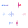
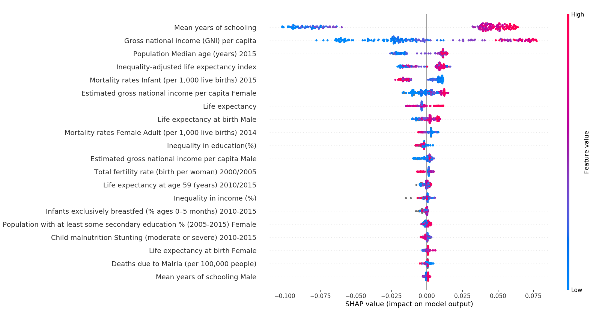

Shap summary plot
=================

Visualize shap summary.

.. note:: At this moment, this widget only accepts models generated by RandomForest(Regressor,Classifier).

Signals
-------

Inputs
~~~~~~

- Data

- Model

Outputs
~~~~~~~

- Top Features

Description
-----------

In this widget, you can visualize the shap summary.

One can select the number of top features.
